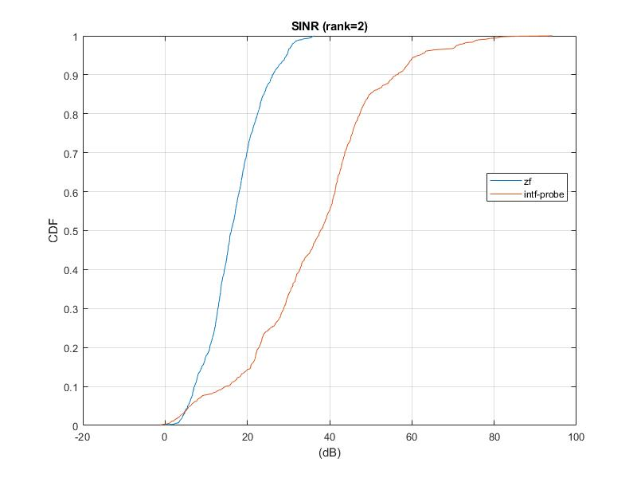
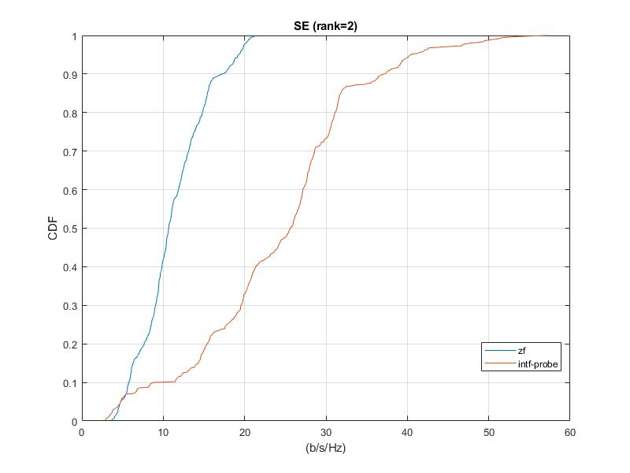

# Bi-directional Training for 5G Massive MIMO <sub><br>An approach for interference probing and mitigation to achieve high spectrum efficiency </sub>


Bi-directional Training (BiT) is an effective approach to mitigating both inter-cell and intra-cell interference in a Massive MIMO network and can achieve high spectrum efficiency (SE) in 5G. This project is a *minimal* demo of one type of BiT implementation in Matlab with a number of *ideal* and *simplifying* assumptions. The demo shows an SINR improvement of about tens of dB and SE gain of about 100%, due to the superb capability of interference mitigation by BiT.

## Getting Started

### Prerequisites

* Matlab (or Octave)

### Downloading

The package can be downloaded or cloned at https://github.com/futureweiwirelesslab/bi-directionalTraining by clicking on the green button **Clone or download** on the page. Alternatively:
```
git clone https://github.com/futureweiwirelesslab/bi-directionalTraining
```

No installation is needed, but make sure the downloaded files are in one folder.

## Simulation and results

### Running the simulation

In Matlab, change to the folder containing the downloaded files. Execute:

```
Intf_prob
```
You should see output:

```
>> Intf_prob
Processing RBG : 1/8
Processing RBG : 2/8
Processing RBG : 3/8
Processing RBG : 4/8
Processing RBG : 5/8
Processing RBG : 6/8
Processing RBG : 7/8
Processing RBG : 8/8

SE_zf =

   37.3271


SE_intf _prob =

   80.5337
```

Two figures will also be generated:





### Understanding the simulation results

The simulator models a multi-cell Wideband TDD system with Massive MIMO. Two approaches are compared. The baseline is zero-forcing (ZF) based Massive MIMO which is known to be able to suppress intra-cell interference (i.e., multi-user interference or inter-UE interference) via ZF precoding for multi-user MIMO (MU MIMO) downlink transmissions. The other approach is based on BiT, in which the scheduled UEs transmit interference-probing SRS in the uplink so that the base stations can infer information about downlink interference, and the base stations then adjust precoders accordingly to reduce intra-cell and inter-cell interference in the downlink; see below references for more details.

The simulation results show that the BiT approach with interference probing and mitigation significantly outperforms the ZF approach. In particular, the per-layer post-combining receive SINRs for most of the UEs increase by 10 dB to 40 dB, and the average SE increases from 37 bps/Hz to 80 bps/Hz, more than 100% gain.


### Simulation assumptions

***Important Note:*** **This is a minimal simulator with ideal and simplifying assumptions. It is to show at the conceptual level how BiT may lead to gains.** It is not a substitute for full-blown system-level simulations. Performance gains can vary depending on the modeling methodologies and parameters. For evaluations under more practical assumptions, refer to the publications or contact the authors.

|Items |	Parameters |
|--- |	------------ |
|Carrier	| 3.5 GHz with 10 MHz bandwidth |
|Network deployment |	3GPP 36.873 UMi, ISD = 200 m, 21 sectors (with wraparound; in 7 cell sites) |
|UE distribution |	70 UEs uniformly distributed, 80% indoor UEs |
|Channel |	3D UMi wideband channel  |
|gNB antenna configurations |	 4x8x2 (8 columns, 4 rows, cross polarization, totally 64 ports), 0.5 wavelength spacing
|UE antenna configurations | 2x1x2 (2 columns, 1 row, cross polarization, totally 4 ports) 0.5 wavelength spacing |
|UE power |	23 dBm |
|gNB power |	47 dBm |
|Simulated frequency-domain granularity |	Resource block group (8 RBGs for 10 MHz) |
|Simulated time-domain granularity |	1 TTI for uplink SRS and 1 TTI for downlink transmission (one-shot BiT) |
|Noise figure |	3 dB at gNB, 6 dB at UE |
|Channel/covariance estimation |	For gNB: ideal channel/covariance estimation; for UE: ideal channel/covariance estimation |

### Files

* Intf_prob.m: main script for the simulation
* antenna_64x4_70ue.mat: Matlab data file storing channel data for the simulation
* myCDF.m: auxiliary function for generating CDF

## Going beyond

### Brief description of the theory and intuition

Most techniques for Massive MIMO aim at suppressing intra-cell interference but not inter-cell interference. To further improve and maximize SE performance, a network-wise global optimization problem incorporating intra-/inter-cell interference modeling is formulated [1]. A centralized solution is then obtained. Furthermore, utilizing TDD uplink-downlink reciprocity, the solution is distributed to each base station and UE and only local CSI and local decision making are required. The distributed solution may be implemented iteratively among the base stations and UEs or in a one-shot fashion (i.e., one uplink transmission and then one downlink transmission), and hence the name "Bi-directional Training." Both the centralized solution and BiT can lead to substantial SE gains due to the suppression of intra-/inter-cell interference.

The one-shot BiT is briefly described as follows [5,6]. Given a set of base stations, UEs, and radio resources for uplink and downlink transmissions, the UEs first transmit uplink SRS on the resources at the same time. Then by TDD reciprocity, a base station seeing strong uplink SRS interference from a certain spatial direction (for example, via estimating the uplink spatial covariance of the SRS transmissions) implies that in downlink transmission the base station will cause strong interference in that direction. The base station can then adjust the precoder for downlink interference avoidance. Then the base stations transmit downlink signals with the BiT precoders on the resources at the same time, leading to much less interference to the UEs. Some practical considerations for supporting BiT are also discussed in [5,6].


### What you may do next

There are a number of things you may feel interested to do next. For example, you may load your own channel data with different network deployments, UE numbers and distributions, base station antenna configurations, UE antenna configurations, time-/frequency-domain granularities, etc., to this minimal simulator and see the potential BiT performance. You can also test the impact of EVM, rank adaptation, etc.

If you are more serious, you can evaluate the BiT performance with assumptions commonly used in 3GPP. To this aim, you will need a full-blown system-level simulator and insert the BiT precoder adjustment procedure into your simulator. A few tips:

* The first step may be just replacing your MU precoder by BiT precoder without changing other steps. You can use the minimal simulator to help verify that your simulator can generate the correct BiT precoders.

* Pay special attention to how your uplink channel matrix and downlink
 channel matrix are related: is one the transpose of the other, or the Hermitian of the other? For the former, apply complex conjugation to the BiT precoder for downlink transmission.

* To see the full throughput performance gain of BiT in your system simulation, you may need to modify your link adaptation, adjust scheduling and MU pairing, rank adaptation, improve channel/covariance estimation, implement the wideband BiT algorithm [2], and so on.

There is a lot of interesting research and evaluation work around BiT. Contact us if you have comments, suggestions, or questions.

## Authors

* **Wireless Research and Standards, FUTUREWEI**

For comments and questions, please contact [Weimin Xiao](mailto:Weimin.Xiao@FUTUREWEI.com), [Jialing Liu](mailto:Jialing.Liu@FUTUREWEI.com), and [Qian Cheng](mailto:Q.Cheng@FUTUREWEI.com).

## License

This project is licensed under the MIT License - see the [LICENSE](LICENSE) file for details.

## References

* Theoretic development

  [1]	H. Zhou, J. Liu, Q. Cheng, D. Maamari, W. Xiao, and A. C. K. Soong, "Bi-Directional Training with Rank Optimization and Fairness Control," in 2018 IEEE 88th Vehicular Technology Conference (VTC-Fall), 2018.

  [2]	J. Liu, Q. Cheng, W. Xiao, D. Maamari, and A. C. K. Soong, "Bi-directional Training for Wideband Systems," in 2019 IEEE 89th Vehicular Technology Conference (VTC-Fall), 2019.

  [3]	H. Zhou, M. L. Honig, J. Liu, and W. Xiao, "Bi-directional Training for FDD Systems," in 2019 IEEE Global Communications Conference (GLOBECOM), 2019.

  [4]	H. Zhou, M. L. Honig, "Deep Learning for Selecting Precoder Ranks," in 2019 IEEE Global Communications Conference (GLOBECOM), 2019.

* 3GPP proposals

  [5]	R1-1909018, "TDD cooperative MIMO enhancement via sounding based interference probing," FUTUREWEI, 3GPP TSG RAN WG1 Meeting #98, Prague, Czech Republic, August 26-30, 2019.

  [6]	RP-191869, "Rel-17 work scope on NR MIMO," FUTUREWEI, 3GPP TSG RAN  Meeting #85, Newport Beach, USA, September 16-20, 2019.
